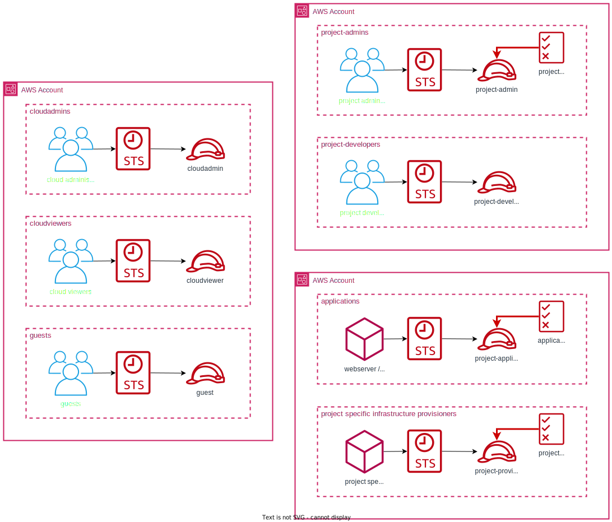
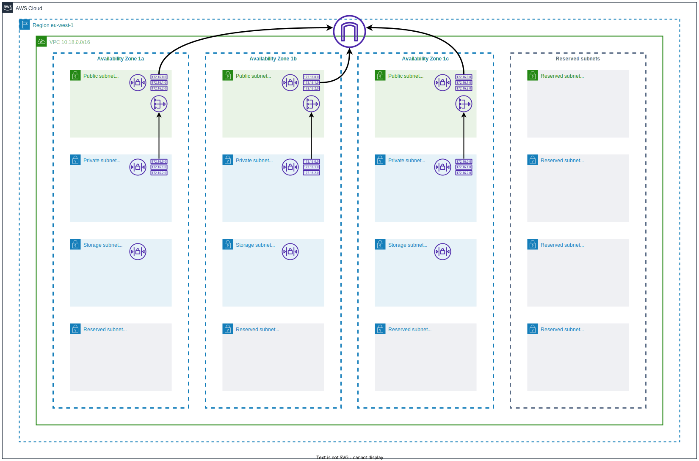

# terragrunt-aws-infrastructures
This terragrunt code provisions my test environment in AWS cloud (see [microcloud organization](#organization-microcloud)).
I use this environment to practice AWS concepts, prepare to AWS certificates and verify crazy ideas. Besides README.md,
further documentation can be found in commits, code comments and nested README files.
<br><br>
Feel free to explore and copy everything you want.
Enjoy!
<br><br>
Terragrunt uses terraform modules from this repository: [terraform-aws-modules](https://github.com/mateusz-uminski/terraform-aws-modules)

# Requirements
1. Terraform version ~> 1.3.3
2. Terragrunt version ~> 0.39.2
3. AWS Accounts

# How to use?
0. Create config.yaml in the project's root directory according to the example-config.yaml.
1. Do steps from [Organization design](#how-to-prepare-an-aws-organization?).
2. Configure the following profiles in `~/.aws/credentials` and `~/.aws/config`:
- `mcd-cloudadmin-mgmt`
- `mcd-cloudadmin-shared`
- `mcd-cloudadmin-nonprod`
- `mcd-cloudadmin-prod`
3. Execute `terragrunt run-all microcloud-management/.settings`

# How to prepare an AWS Organization?
1. Create at least 4 AWS accounts: one for the management account, one for shared/central services such as Route53,
 one nonprod account and one prod account.
2. Configure MFA on each account.
3. Create an AWS Organization on management account, set consolidated billing and invite other accounts to the organization.
4. Enable SCP in the organization.
5. On each account create cloudadmin IAM user, then attach directly existing policy `AdministratorAccess` to it.
6. Configure MFA for each cloudadmin user.
7. Generate AWS_ACCESS_KEY_ID and AWS_ACCESS_SECRET_KEY for each cloudadmin user.
8. Execute `cd microcloud-management/.settings/organization && terragrunt apply` and then attach AWS accounts to appropriate
organizational units.
9. Enable IAM Identity Center.
10. Change MFA settings to: `Every time they sign in (always-on)` and `Require them to register an MFA device at sign in`.
11. Enable `Attributes for access control`.
12. Add the following attribute: `ac:project = ${path:enterprise.division}`.

# Project structure
Note: modules that configure either account or region should be placed in the `.settings` directory.
The code in this repo uses the following project structure ():
```
|
| account-name/
| | region-name/
| | | stack-name/
| | | | environment/
| | | | | - terragrunt.hcl
| | | | | - main.tf
...
```

For instance:
```
| account-nonprod/
| | us-east-1/
| | | .settings/
| | | | vpc/
| | | | | - main.tf
| | | | | - terragrunt.hcl
| | | stackA/
| | | | dev/
| | | | | - terragrunt.hcl
| | | | | - main.tf
| | | - region.hcl
| |
| | .settings/
| | | stackB/
| | | | - terragrunt.hcl
| | | | - main.tf
| |
| | eu-west-1/
| | | .settings/
| | | | vpc/
| | | | | - main.tf
| | | | | - terragrunt.hcl
| | | stackC/
| | | | dev/
| | | | | - terragrunt.hcl
| | | | | - main.tf
| | | - region.hcl
| |
| | - account.hcl
```

# Organization: microcloud
- [Organization design](##organization-design)
- [IAM design](##iam-design)
- [Resource naming convention](##resource-naming-convention)
- [Resource tagging convention](##resource-tagging-convention)
- [Network design](##network-design)


## Organization design
The microcloud organization operates in the following regions:
- us-east-1
- eu-west-1

Creation of the resources in other regions is prohibited by Service Control Policy (SCP)

In the organization there are two main projects:
- micropost: it is an yet another blog web application
- microdata: it is an data engineering platform


## IAM Design
There are following IAM Roles that can be used to access an AWS account within the microcloud organization:
- **cloudadmin**: grants access to an account with `AdministratorAccess` privileges.
- **cloudviewer**: grants access to an account with `ReadOnlyAccess` privileges.
- **guest**: allows to grant access to an account to specific individuals with personalized permissions.
- **project-admin** (`micropost-admin`, `microdata-admin`): grants access to an AWS account with `AdministratorAccess` privileges with the imposed permissions boundary policy named `mcd-project-admin-permissions-boundary-policy`.
- **project-developer** (`micropost-developer`, `microdata-developer`): grants access to an AWS account with `ReadOnlyAccess` privileges. The project's developer permissions can be extended to include the ability to edit resources belonging to the project in which the developer is working, if necessary.


The IAM Role assignment matrix:
|                   | microcloud-management | microcloud-shared | microcloud-nonprod    | microcloud-prod   |
| :---              | :---:                 | :---:             | :---:                 | :---:             |
| cloud engineer    | cloudadmin            | cloudadmin        | cloudadmin            | cloudadmin        |
| devops            | cloudviewer           | cloudviewer       | project-admin         | project-developer |
| developer         | -                     | cloudviewer       | project-developer     | cloudviewer       |
| individuals       | guest                 | guest             | guest                 | guest             |

Note: The roles that have names starting with the project's name grant permissions to AWS resources based on either the principal tag (tags with the prefix `ac:`) or the resource's name.

source:
- [aws docs: abac](https://docs.aws.amazon.com/IAM/latest/UserGuide/tutorial_attribute-based-access-control.html)
- [aws security blog: abac](https://aws.amazon.com/blogs/security/working-backward-from-iam-policies-and-principal-tags-to-standardized-names-and-tags-for-your-aws-resources/)




## Resource naming convention
| resources         | pattern                                                   |
| :---              | :---                                                      |
| s3                | `org-<project?>-*`                                        |
| vpc               | `org-<main/reserved>-vpc-tier`                            |
| network resources | `org-<main/reserved>-<public/private/storage>-sn#-tier`   |
| network resources | `org-<main/reserved>-*-resource-tier`                     |
| *                 | `org-project-*-resource-<environment?/tier?>`             |


## Resource tagging convention
The tables below show the tags used in the organization. The tags are categorized into sections, with certain exceptions. Each section is assigned its unique name, which is added as a prefix to the tag name.

| tag                   | example value             | resources     | required  |
| :---                  | :---:                     | :---:         | :---:     |
| Name                  | mcd-main-vpc-nonprod      | *             | optional  |

| tag                   | example value | resources     | required  |
| :---                  | :---:         | :---:         | :---:     |
| business:cost-center  | 78925         | *             | yes       |

| tag                   | example value     | resources     | required  |
| :---                  | :---:             | :---:         | :---:     |
| tech:project          | microdata         | *             | yes       |
| tech:environment      | dev               | *             | yes       |
| tech:repo             | owner/repo-name   | *             | yes       |
| tech:path             | path/to/stack     | *             | yes       |
| tech:created-date     | DD-MM-YYYY        | *             | yes       |
| tech:updated-date     | DD-MM-YYYY        | *             | yes       |

| tag                   | example value | resources     | required  |
| :---                  | :---:         | :---:         | :---:     |
| ac:project            | microdata     | *             | yes       |

| tag                   | example value             | resources         | required  |
| :---                  | :---:                     | :---:             | :---:     |
| net:tier              | private/public/storage    | network resources | yes       |

| tag                   | example value             | resources     | required  |
| :---                  | :---:                     | :---:         | :---:     |
| data:classification   | internal/restricted/...   | s3,rds        | optional  |


## Network design

### IP addressing

The `10.0.0.0/9` range was used for IP addressing planning. During the planning, the address ranges shown in the table below should be excluded.

| ip ranges to avoid    |                               |
| :---                  | :---:                         |
| common choice         | 10.0.0.0/16 - 10.15.0.0/16    |
| aws default           | 172.31.0.0/16                 |
| gcp default           | 10.128.0.0/9                  |
| vpn                   | 172.16.0.0/16                 |
| docker default        | 172.17.0.0/16                 |
| k8s calico default    | 192.168.0.0/16                |
| office                | 192.168.16.0/24               |

The number of ranges needed was calculated from the following formula:
```
number of ranges = number of accounts * number of regions in each account *  number of vpc in each region
number of ranges = (3 accounts + one reserved) * (us-east-1 + eu-west-1 + one region reserved) * (main vpc + reserved vpc)
number of ranges = 4 * 3 * 2 = 24
```

IP addressing plan for the `microcloud` organization:
| account name          | vpc       | us-east-1     | eu-west-1     | reserved      |
| :---                  | :---:     | :---:         | :---:         | :---:         |
| microcloud-management | -         | -             | -             | -             |
| microcloud-shared     | main      | 10.16.0.0/16  | 10.18.0.0/16  | 10.20.0.0/16  |
|                       | reserved  | 10.17.0.0/16  | 10.19.0.0/16  | 10.21.0.0/16  |
| microcloud-nonprod    | main      | 10.22.0.0/16  | 10.24.0.0/16  | 10.26.0.0/16  |
|                       | reserved  | 10.23.0.0/16  | 10.25.0.0/16  | 10.27.0.0/16  |
| microcloud-prod       | main      | 10.28.0.0/16  | 10.30.0.0/16  | 10.32.0.0/16  |
|                       | reserved  | 10.29.0.0/16  | 10.31.0.0/16  | 10.33.0.0/16  |
| reserved              | main      | 10.34.0.0/16  | 10.36.0.0/16  | 10.38.0.0/16  |
|                       | reserved  | 10.35.0.0/16  | 10.37.0.0/16  | 10.39.0.0/16  |

The following ranges can still be used in the organization: `10.40.0.0/16 - 10.127.0.0/16`

### VPC structure
Each VPC in the organization is designed as a 3 tier VPC.
- **public subnets**: both inbound and outbound traffic to the public internet are allowed.
- **private subnets**: each subnet has its own NAT gateway. Outbound traffic to the public internet and only inbound traffic from the organizations VPC is allowed.
- **storage subnets**: inbound traffic is limited to only come from the private subnets, and outbound traffic is allowed only to the VPC.

The number of subnets needed was calculated from the following formula (each range is divided in equal subnets):
```
number of subnets = number of AZs * number of tiers
number of subnets = (3 AZs + one reserved) * (3 tiers + one reserved)
number of subnets = 4 * 4 = 16

10.x.y.z/16 => 65534  # available ip addresses in each vpc
65534 / 16 = 4095  # each subnet should have 4095 addresses

10.x.y.z/20 => 4096  # network mask that should be used
```

Each subnet has available `4095-5` addresses. These addresses are reserved in each subnet:
```
.0 => network address
.1 => vpc router
.2 => dns resolver
.3 => future use
.<last> => network broadcast address
```

An example vpc design:



### VPN

### Route53

### VPC Peering
